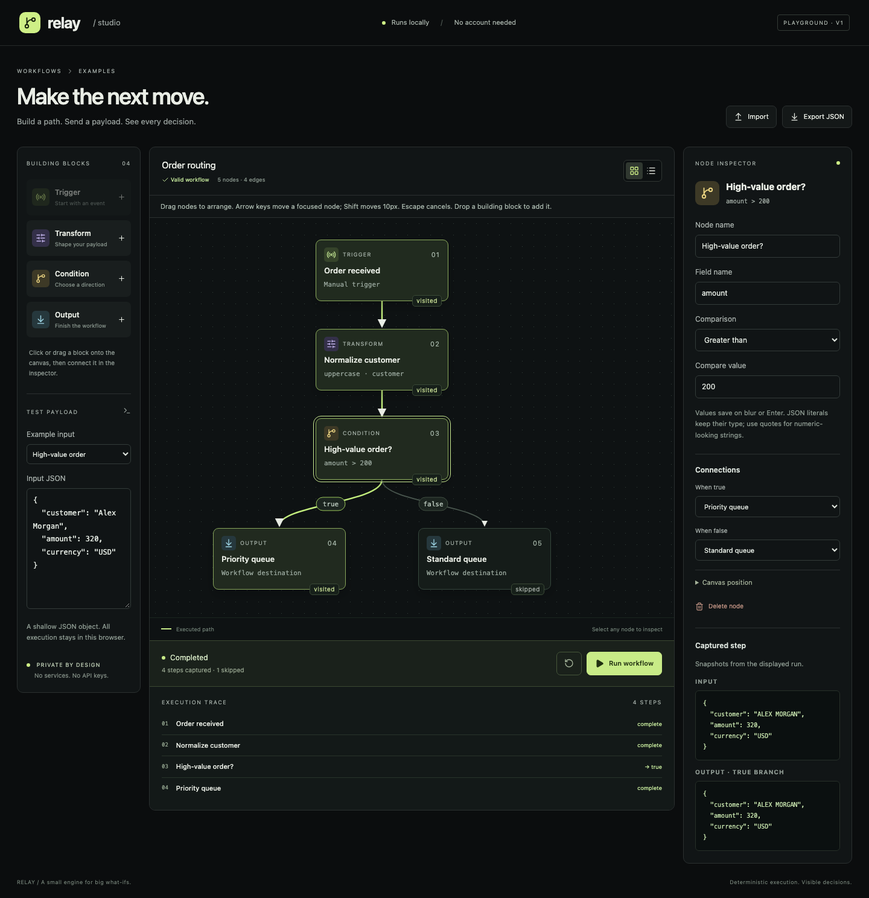

# Relay

**Build a path. Send a payload. See every decision.**

Relay is a local visual workflow studio with a real, bounded execution engine. Route an order through editable transformations and branches, then inspect the exact input and output at every visited node. No account, API key, remote execution or telemetry.



[View the mobile layout](docs/screenshots/mobile.png) · [Behavior contract](SPEC.md) · [Architecture](docs/ARCHITECTURE.md) · [Security](docs/SECURITY.md) · [Scaling design](docs/SCALABILITY.md)

**[Open the live demo](https://nen-io.github.io/relay-workflow-studio/)** · [CI checks](https://github.com/nen-io/relay-workflow-studio/actions)

## Try it locally

```sh
nvm use
npm ci
npm run dev
```

Open `http://127.0.0.1:4301`. Node 24 is required; the lockfile pins dependencies. To run browser tests once Chromium is installed:

```sh
npx playwright install chromium
npm run check
npm run test:e2e
```

| Script              | Purpose                                     |
| ------------------- | ------------------------------------------- |
| `npm run dev`       | Loopback Vite development server, port 4301 |
| `npm run typecheck` | Strict TypeScript check                     |
| `npm test`          | Domain, persistence and cancellation tests  |
| `npm run build`     | Typecheck and production static bundle      |
| `npm run check`     | Typecheck, unit tests and build             |
| `npm run test:e2e`  | Chromium user journeys and real screenshots |

## A two-minute walkthrough

1. The supplied **Order routing** graph normalizes a customer's name and sends amounts above 200 to **Priority queue**. Click **Run workflow**. Four real steps appear; Standard queue is skipped.
2. Select **Normalize customer** to compare its input and output. Earlier snapshots retain the original casing.
3. Select **High-value order?**, change **Compare value** to 400 and press Tab or Enter to apply it. Run again: the same amount now reaches Standard queue.
4. Choose **Missing customer · fails**. The transform fails explicitly and later nodes remain skipped. Edit the JSON to supply a customer and rerun.
5. Drag a building block onto the canvas (or click it to add), then drag nodes to arrange the workflow. Arrow keys move a focused node by 1px; Shift moves 10px. Escape cancels an in-progress drag.
6. Add an output and connect it through **When true**. Delete the old, now-unreachable output. Run to verify the new route. The list view and connection selects support keyboard operation.
7. Export the validated JSON, reset the example, then import your file. Invalid or oversized imports leave your graph and result intact.

## Built to explain itself

- Editable trigger, transform, condition and output nodes; real connections, direct node dragging, library drop placement and numeric layout controls.
- Three finite transforms: uppercase, multiply and assign. No arbitrary code or evaluation.
- Deterministic, React-independent generator engine with immutable input/output snapshots.
- Cancellable execution, generation-fenced timers and captured workflow/input versions.
- Explicit schema and graph validation, resource limits and safe import/export.
- Valid drafts saved locally; corrupt or denied storage is visible and nonfatal.
- Responsive list layout, labelled inputs, keyboard controls and reduced-motion behavior.
- Production Content Security Policy; no external assets, network calls or analytics.

## Deliberate limits

This is an educational browser application, **not a production automation service**. It performs no webhooks, external actions, durable jobs or authenticated multiuser work. Workflows contain 1–40 nodes and at most 80 edges; input is a shallow object with at most 100 scalar fields. Import/export is limited to 128 KiB. Only complete valid graphs are persisted; partially connected edits survive in the current tab but are not saved. Input payloads and execution traces are not persisted. Dragging is optional: the list view and numeric inspector controls remain available. Desktop library drag/drop adds blocks; tablet pointers can move existing nodes. Narrow screens use the list layout.

See [schema and walkthrough](docs/ARCHITECTURE.md), [five decision records](docs/DECISIONS.md), [test evidence and limitations](docs/TESTING.md), [visual design](docs/DESIGN.md), and [asset provenance](docs/ASSETS.md). Source is MIT licensed.
