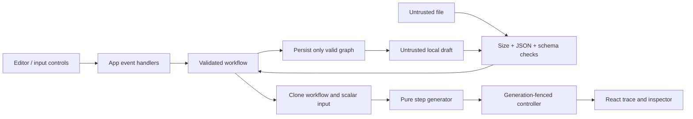

# Architecture and behavior

## Boundaries

The React application coordinates user intent. The domain modules own all workflow semantics. Execution contains no React, DOM, network, storage, timers or global application state. `RunController` wraps that pure generator with presentation scheduling; it is separately tested using a virtual clock.

| Module                         | Responsibility                                                                        |
| ------------------------------ | ------------------------------------------------------------------------------------- |
| `src/domain/workflow.ts`       | Types, scalar/input guards, graph validation, import/export, immutable delete/connect |
| `src/domain/engine.ts`         | `createExecution`, `runWorkflow`, per-node transforms and `RunController`             |
| `src/domain/storage.ts`        | Versioned storage key, validated restore and nonfatal save warnings                   |
| `src/domain/fixtures.ts`       | Synthetic order workflow and three input scenarios                                    |
| `src/App.tsx`                  | Workflow/input selection, run lifecycle, import epoch, persistence and commands       |
| `src/components/Graph.tsx`     | SVG connections and native selectable node buttons; responsive list                   |
| `src/components/Inspector.tsx` | Configuration, scalar/position drafts, connections and captured payloads              |
| `src/styles.css`               | Theme, responsive layout, focus and reduced-motion rules                              |

## Example: changing an amount threshold

The condition inspector keeps a local text draft so normal incremental typing is not rewritten into JSON quotes. On blur or Enter it decodes a scalar (including explicitly quoted strings), then commits a new node and workflow object. The application validates before persisting. If editing temporarily disconnects the graph, the current tab still displays the edit, but a visible warning explains that the previous valid persisted draft remains.

Run first parses the input and validates the graph. A failed check preserves the previous run and graph. A successful start clones the graph and scalar input. Editing controls are disabled while running. The controller requests one generator step per timer tick. The engine applies the transform or condition, clones input/output snapshots and yields a step. React receives a new state object, highlights visited edges and displays the trace. On completion the engine returns visited IDs, skipped IDs and any failure node. Only the chosen branch executes. A missing or wrong-type field fails at its node; it does not silently skip or coerce.

Cancel increments the controller generation and clears its timer. Even a queued callback cannot advance a cancelled generation. Reset does the same and restores the example. Import reads have a separate generation counter; an intervening edit, run or reset prevents an older file read from replacing current state. Failed imports preserve graph and trace. Importing a valid workflow clears the previous execution.

## Version 1 schema

A document has `version: 1`, nonempty `id` and `name`, a `nodes` array and an `edges` array. Names/IDs are capped at 160 characters. Each node has `id`, `label`, `type`, and a finite `{x,y}` position in 0–3000. Node IDs and edge IDs are unique.

- `trigger`: one outgoing edge, no incoming edge, exactly one per document.
- `transform`: one outgoing edge and an operation: `{kind:"uppercase",field}`, `{kind:"multiply",field,factor}`, or `{kind:"assign",field,value}`. Fields are ≤80 characters and cannot be `__proto__`, `constructor` or `prototype`. Arithmetic factors and results must be finite.
- `condition`: `field`, `comparator` (`equals` or `greater-than`) and scalar `value`. Equality uses JavaScript strict equality; greater-than requires numeric values. Exactly one outgoing `true` and one outgoing `false` edge. Both may point at the same target; branch identity still matters.
- `output`: no outgoing edges.

Edges contain `id`, `source`, `target`, and, only for conditions, `branch: "true" | "false"`. All nodes must be reachable; cycles, dangling nodes and duplicate connection tuples are invalid. Structural unknown properties are ignored by execution, but forbidden property keys are rejected throughout the document and nesting is capped at 12. This is a permissive versioned envelope, not a claim of a complete JSON Schema implementation.

Input is a shallow JSON object with ≤100 scalar fields: finite number, boolean, null or string ≤4096 characters. Assignment respects the field bound; uppercase checks expansion; multiplication rejects nonfinite results. The engine validates direct input as well as text input, so Infinity is not silently converted to null through serialization.

Validation order: byte limit → JSON parse → forbidden keys/depth → envelope and array bounds → node/edge shape → IDs/connections/branch counts → reachability/cycles. No engine step occurs before successful validation.

See `examples/order-routing.json` and `examples/input-priority.json` for real accepted documents.

## Browser and deployment

Vite emits relative asset URLs (`base: './'`) so a GitHub repository subpath works. Production builds add a meta Content Security Policy: scripts only from the same origin, no connections, no objects or forms, same-origin images/fonts. Inline styles remain permitted for numeric layout styles; script inline execution is prohibited. Development omits this policy for Vite's HMR. No custom service worker or offline installation is present. Refresh loads the static app; local drafts then restore after validation.

## Official references consulted

Checked 17 September 2026 while implementing the installed stack:

- [React: You might not need an Effect](https://react.dev/learn/you-might-not-need-an-effect): derived state stays in render; commands live in event handlers. Effects here synchronize local text drafts and dispose the controller.
- [Vite: Static deployment](https://vite.dev/guide/static-deploy.html): relative base and static bundle deployment.
- [Vitest: Getting started](https://vitest.dev/guide/): domain suite and isolated test configuration.
- [Playwright: Assertions](https://playwright.dev/docs/test-assertions): outcome assertions against the actual browser.
- [Prettier: Installation](https://prettier.io/docs/install): exact local formatter version and reproducible source formatting.

## Canvas gesture boundary

`Graph` owns transient drag state and measured node heights. The workflow remains unchanged during a gesture, so engine snapshots and stored drafts never contain intermediate positions. The parent `move` callback replaces exactly one node position on release; the normal `change` function validates persistence. Beginning a gesture fences outstanding file imports. Pointer positions are calculated from the current canvas rectangle and original grab offset, so page/canvas scrolling is accounted for. A monotonically growing presentation extent prevents scrollbar clamping from changing the drag coordinate frame. Reset/import remounts the canvas and clears that presentation extent. Drag/drop uses an exact block-type allowlist and the parent's existing capacity/one-trigger guard.
